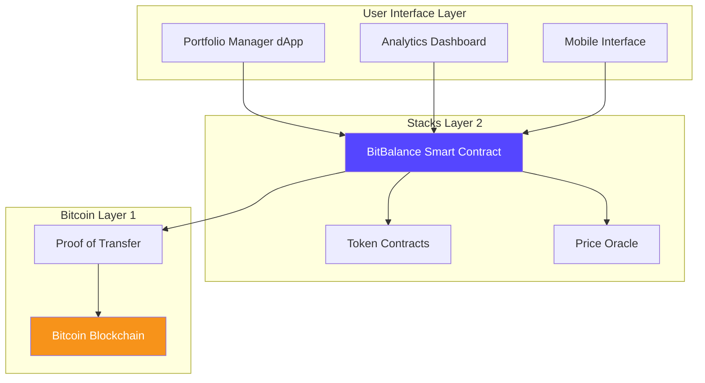
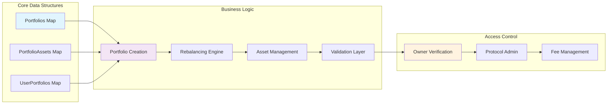
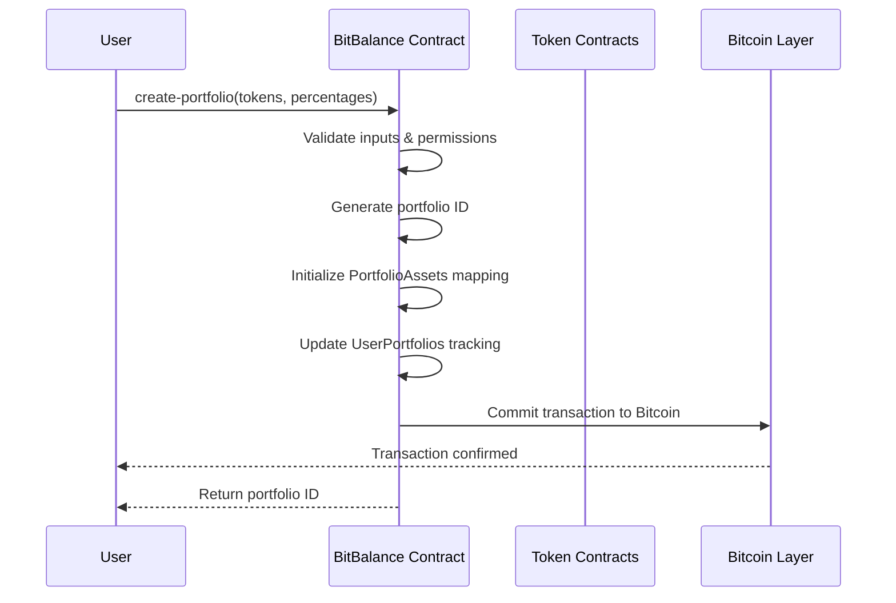
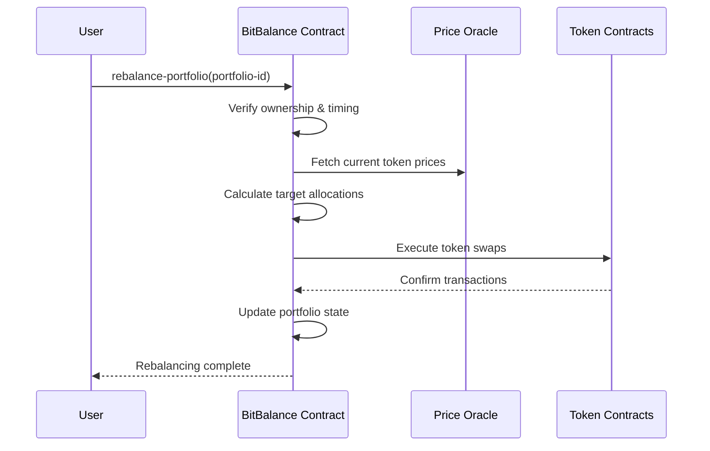

# BitBalance Protocol 🚀

> **Automated Portfolio Management on Bitcoin Layer 2**

[](https://stacks.co)
[](https://bitcoin.org)
[](https://clarity-lang.org)
[](LICENSE)

BitBalance revolutionizes decentralized finance by providing a trustless, automated portfolio management system built on Stacks Layer 2. Leverage Bitcoin's security while enjoying smart contract flexibility and minimal transaction fees for sophisticated DeFi strategies.

---

## 🎯 **Key Features**

- **🔄 Automated Rebalancing**: Set-and-forget portfolio management with intelligent rebalancing
- **🎨 Custom Allocations**: Support for up to 10 different tokens with precise percentage control
- **🔒 Bitcoin Security**: Inherited security from Bitcoin's proof-of-work consensus
- **⚡ Layer 2 Efficiency**: Fast transactions with minimal fees on Stacks
- **🛡️ Trustless Design**: No custodial risk - you maintain full control of your assets
- **📊 Multi-Portfolio Support**: Manage up to 20 portfolios per user account

---

## 🏗️ **System Architecture**

### **High-Level Architecture**



### **Contract Architecture**



---

## 🔄 **Data Flow**

### **Portfolio Creation Flow**



### **Rebalancing Flow**



---

## 📋 **Smart Contract Overview**

### **Core Data Structures**

| Map | Key | Value | Purpose |
|-----|-----|-------|---------|
| `Portfolios` | `uint` | Portfolio metadata | Stores core portfolio information |
| `PortfolioAssets` | `{portfolio-id, token-id}` | Asset allocation data | Individual token allocations |
| `UserPortfolios` | `principal` | List of portfolio IDs | User ownership tracking |

### **Key Functions**

#### **Public Functions**

- `create-portfolio` - Create new diversified portfolio
- `rebalance-portfolio` - Execute automated rebalancing
- `update-portfolio-allocation` - Modify asset allocations
- `deactivate-portfolio` - Soft delete portfolio

#### **Read-Only Functions**

- `get-portfolio` - Retrieve portfolio information
- `calculate-rebalance-amounts` - Check rebalancing requirements
- `get-user-portfolios` - List user's portfolios
- `get-protocol-info` - Protocol configuration

---

## 🚀 **Getting Started**

### **Prerequisites**

- [Stacks CLI](https://docs.stacks.co/docs/write-smart-contracts/cli-walkthrough) installed
- [Clarinet](https://github.com/hirosystems/clarinet) for local development
- Stacks wallet (Hiro Wallet recommended)

### **Installation**

```bash
# Clone the repository
git clone https://github.com/godwin-smart/bit-balance.git
cd bitbalance-protocol

# Install Clarinet
curl -L https://github.com/hirosystems/clarinet/releases/latest/download/clarinet-linux-x64.tar.gz | tar xz
sudo mv clarinet /usr/local/bin

# Initialize project
clarinet new bit-balance
cd bit-balance
```

### **Local Development**

```bash
# Check contract syntax
clarinet check

# Run tests
clarinet test

# Start local devnet
clarinet integrate

# Deploy to testnet
clarinet deploy --testnet
```

---

## 📊 **Usage Examples**

### **Creating a Portfolio**

```clarity
;; Create a balanced portfolio with 3 tokens
(contract-call? .bitbalance create-portfolio 
    (list 'SP2C2YFP12AJZB4MABJBAJ55XECVS7E4PMMZ89YZR.usda-token
          'SP3K8BC0PPEVCV7NZ6QSRWPQ2JE9E5B6N3PA0KBR9.age000-governance-token
          'SP1H1733V5MZ3SZ9XRW9FKYGEZT0JDGEB8Y634C7R.miamicoin-token)
    (list u4000 u3000 u3000)) ;; 40%, 30%, 30%
```

### **Rebalancing a Portfolio**

```clarity
;; Rebalance portfolio with ID 1
(contract-call? .bitbalance rebalance-portfolio u1)
```

### **Updating Allocations**

```clarity
;; Update token 0 to 50% allocation
(contract-call? .bitbalance update-portfolio-allocation u1 u0 u5000)
```

---

## 🔒 **Security Features**

### **Access Control**

- **Owner-only Operations**: Portfolio modifications restricted to owners
- **Admin Functions**: Protocol-level controls for authorized administrators
- **Input Validation**: Comprehensive validation for all user inputs

### **Economic Security**

- **Fee Caps**: Maximum 5% protocol fee limitation
- **Percentage Validation**: Ensures allocations sum to exactly 100%
- **Rebalancing Cooldown**: 24-hour minimum between rebalancing operations

### **Technical Security**

- **Bitcoin Finality**: Transactions secured by Bitcoin proof-of-work
- **No Custodial Risk**: Users maintain full control of assets
- **Immutable Logic**: Smart contract code cannot be modified post-deployment

---

## 🧪 **Testing**

### **Unit Tests**

```bash
# Run comprehensive test suite
clarinet test

# Run specific test file
clarinet test tests/portfolio-creation.ts

# Generate coverage report
clarinet test --coverage
```

### **Integration Tests**

```bash
# Start local blockchain
clarinet integrate

# Deploy contracts
clarinet deployment apply -p deployments/default.devnet.yaml

# Run integration tests
npm run test:integration
```

---

## 📈 **Roadmap**

### **Phase 1: Core Protocol** ✅

- [x] Basic portfolio creation and management
- [x] Manual rebalancing functionality
- [x] Multi-user support

### **Phase 2: Automation** 🚧

- [ ] Automated rebalancing triggers
- [ ] Price oracle integration
- [ ] Advanced rebalancing strategies

### **Phase 3: Advanced Features** 📋

- [ ] Dollar-cost averaging
- [ ] Yield farming integration
- [ ] Cross-chain asset support
- [ ] Governance token and DAO

### **Phase 4: Enterprise** 🔮

- [ ] Institutional features
- [ ] API and SDK
- [ ] White-label solutions
- [ ] Advanced analytics

---

## 🤝 **Contributing**

We welcome contributions from the community! Please read our [Contributing Guidelines](CONTRIBUTING.md) before submitting pull requests.

### **Development Workflow**

1. Fork the repository
2. Create a feature branch (`git checkout -b feature/amazing-feature`)
3. Commit your changes (`git commit -m 'Add amazing feature'`)
4. Push to the branch (`git push origin feature/amazing-feature`)
5. Open a Pull Request

### **Code Standards**

- Follow [Clarity coding standards](https://docs.stacks.co/docs/write-smart-contracts/clarity-language)
- Include comprehensive tests for new features
- Update documentation for API changes
- Ensure all CI checks pass
